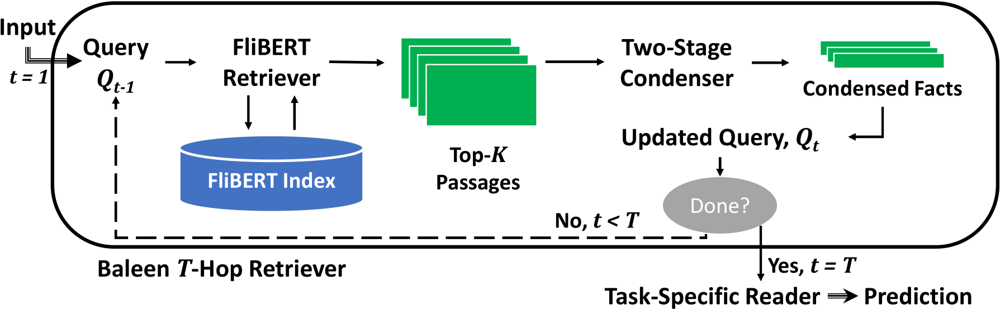

# Baleen

### Baleen is a state-of-the-art model for multi-hop reasoning, enabling scalable multi-hop search over massive collections for knowledge-intensive tasks like QA and claim verification.

<p align="center">
  
</p>
<p align="center">
  <b>Figure 1:</b> Baleen's condensed retrieval architecture for multi-hop search.
</p>


## Installation

The implementation of Baleen lives as part of the parent [ColBERT](https://github.com/stanford-futuredata/ColBERT/tree/new_api) repository (under its `new_api` branch).

After cloning, make sure you obtain the code for the submodule too:

```
git submodule update --init --recursive
```

Please follow the installation instructions from the submodule. Baleen has the same requirements as the parent ColBERT repository.

## Download

We release preprocessed data and models for the HoVer benchmark. The scripts below will use the decompressed files, which you should save under a single `datadir` directory.

```
# Preprocessed HoVer data (3 MB compressed)
wget https://downloads.cs.stanford.edu/nlp/data/colbert/baleen/hover.tar.gz
tar -xvzf hover.tar.gz

# Preprocessed Wikipedia Abstracts 2017 collection (1 GB compressed)
wget https://downloads.cs.stanford.edu/nlp/data/colbert/baleen/wiki.abstracts.2017.tar.gz
tar -xvzf wiki.abstracts.2017.tar.gz

# Checkpoints for Baleen retrieval and condesening (8 GB compressed)
wget https://downloads.cs.stanford.edu/nlp/data/colbert/baleen/hover.checkpoints-v1.0.tar.gz
tar -xvzf hover.checkpoints-v1.0.tar.gz
```

## Indexing

The script below indexes Wikipedia Abstracts 2017, which is the collection used for HoVer (and HotPotQA). It uses the Baleen model trained on HoVer.

Indexing uses the compression mechanism described in [ColBERTv2](https://arxiv.org/abs/2112.01488) to reduce the number of bits per dimension from 16 (as in the paper) to 2. This results in only marginal loss in retrieval quality on HoVer while preserving sentence-level EM and reducing the storage footprint about 5x.

```
python -m hover_indexing --root /path/to/save/experiments/ --datadir /path/to/downloads/ --index wiki17.hover.2bit --nbits 2
```


## Multi-Hop Retrieval

The script below applies 4-hop inference using the queries (claims) in the HoVer dev set.

```
python -m hover_inference --root /path/to/save/experiments/ --datadir /path/to/downloads/ --index wiki17.hover.2bit
```

As the short script illustrates, the interface API is straightforward to use, once the Baleen modules are loaded. Given a text `query`, multi-hop search can be conducted using `baleen.search(query, num_hops=4)`.


If you face any issues, please [open a new issue](https://github.com/stanford-futuredata/Baleen/issues) and we'll help you promptly!

